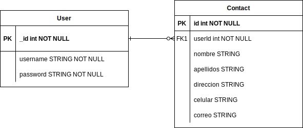
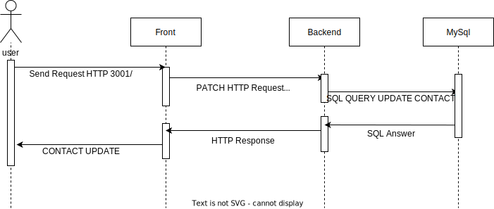
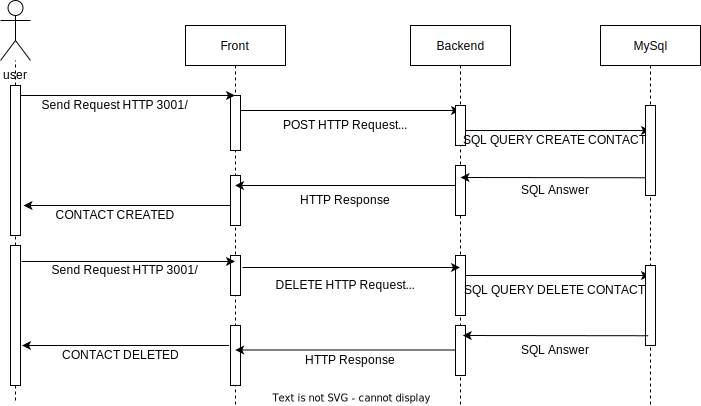

# ContactList_Carvajal

## Developed by 🛠️
* **Jaime Andrés Mayor Aldana**  [AndresMayor](https://github.com/AndresMayor)🚀

## Repositorios🛠️
* **El frontend se desarrollo en este repositorio** [FrontendContactList](https://github.com/AndresMayor/FrontendContactList)🚀

* **El beackend se desarrollo en este repositorio** [BackendContactList](https://github.com/AndresMayor/BackendContactList)🚀

## Requerimientos

-Node instalado.

-NPM instalado.

-Una base de datos MySQl corriendo en el purto 3306 con  nombre PTCarvajal y con un determinado  usuario y contraseña 

-Ingrese las credenciales creadas en el bancked/config.js

## Herramientas Usadas

-Node.js.

-React.

-Sequelize.

-MySQL.

-MVC.

-API-REST.

## Script para iniciar el backend

    npm install 

    npm run dev

### Script para iniciar el frontend

    cd frontendcl
    
    npm install
    
    npm start

# Diagrama Entidad - Relacion

# Diagrama de secuencia Login y Registrar Usurario

# Diagrama de secuencia añadir contacto  y eliminar contacto

# Diagrama de secuencia actualizar datos de un contacto

# Docker

## Script para contruir imagen y iniciar  el contenedor del Frontend

    docker build -t andres192715/frontend .   
    
    docker run -t -d andres192715/frontend

## Script para constuir el contenedor del Backend
